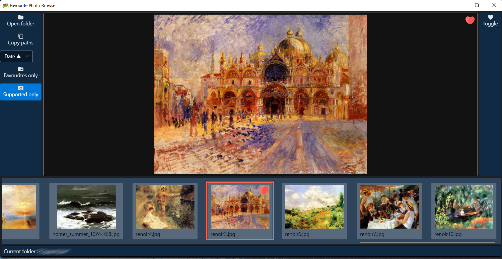

# Favourite Photo Browser
A simple USB/network photo browser with support for caching thumbnails and favourites to local drive

<kbd></kbd>

# Goals

The main reason why this program was created was to satify the following two needs: 
- be able to *efficiently* browse photos located on [NAS](https://en.wikipedia.org/wiki/Network-attached_storage) (or other location that may be slow to read) from my laptop 
- be able to mark favourite photos somehow, *without a need to save anything on the remote drive* (and definetelly without a need to update these photos e.g. to modify [EXIF](https://en.wikipedia.org/wiki/Exif) metadata)

There are already some tools that make the first point possible, but I haven't found a single tool that would satisfy these both needs. 

# Solution 

This program uses a local database (`photos.db`), located in root program directory) to store thumbnails of browsed photos (to improve browsing experience next time you visit the same folder). When browsing, photo can be marked as favourite (use `F` key) and this information is stored in local database along with the thumbnail. 
Finally, it is possible to export (copy to clipboard) paths of all photos marked as favourite in currently opened folder.     

# Typical workflow 
- open folder 
- thumbnails are being loaded; feel free to start looking at the file that were already processed - loading happens in background anyway
- select a pictue (click or use left/righ arrows)
- selected picture (full version) is loaded and shown in main panel; click anywhere to quickly zoom (use `Shift` or `Control` for different zoom levels, even combined) 
- if you like to mark it as favourite, click `F` or click a button; icon will appear 
- you can always change your mind and remove favourite marking 
- whenr you are done, click `copy paths` and paths of all files marked as favourite in current folder will be copied to clipboard

Note: thumbnials and favourite markings arte stored in DB, so no worry - next time you start the progeam and open the same folder, they will be already there.  

# Implementation 

Program is implemented in C# / .Net 6 with UI implemnted in [Avalonia](https://avaloniaui.net/). This means it should work on many platforms, including: 
- Windows 
- Mac OS
- Linux

So far I have only tested Windows, looking for feedback of testing it on other platforms. 


# Release

Current version is an early alpha / MVP version, with basic UI but with both main features (browsing and marking favourites) already working.  
Binaries can be downloaded for Windows only - see [releases page](https://github.com/bartekmotyl/favourite-photo-browser/releases). 
Mac OS/ Linux packages coming soon.  

# Building 

## Windows 

On Windows the easiest way is to use [Visual Studio 2022 Community Edition](https://visualstudio.microsoft.com/vs/community/) which can be downloaded for free from Microsoft.

## Mac / Linux 
On Mac or Linux one may use [JetBrains Rider](https://www.jetbrains.com/rider/) (paid software). Please note that on Mac one may need to install the `mono-libgdiplus` package (`brew install mono-libgdiplus`)

## Command line build 

```
cd "sources/Favourite Photo Browser"
dontnet build 
./bin/Debug/net6.0/Favourite\ Photo\ Browser
```

# Future ideas
- ~~better UI~~ :white_check_mark: done
- ~~quick zoom~~ :white_check_mark: done 
- ~~improved scrolling of thumbnails list~~ :white_check_mark: done
- ~~change order of files on the list (currently by file date) - name, file date, date taken, ascending/descending, maybe even shuffle~~ :white_check_mark: done 
- pre-caching of images in selected folders (to make browsing even more efficient later)
- ~~selecting folder from folder tree~~ - skipped for now  
- ~~toggle showing only favourite images (in currernt folder)~~ :white_check_mark: done 
- more export options (e.g. copy favourite images to a target folder) 
- ... more ideas welcome 

# Contribution 

If you would like to help to make the program better (and especailly if you have experience with C# programming), please contact me! 
